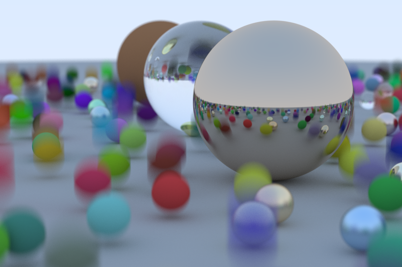

# Ray Tracer in Rust

This ray tracer implementation is written in Rust and is based on the [_Ray Tracing In One Weekend_](https://raytracing.github.io/) book series by Peter Shirley.

## Progress

So far all the features from the first book are implemented. From the second book Motion blurring is implemented.

Additionally the ray tracer supports loading of 3D models from `obj` files.

Computation of samples per pixel are parallelized using [rayon](https://crates.io/crates/rayon).